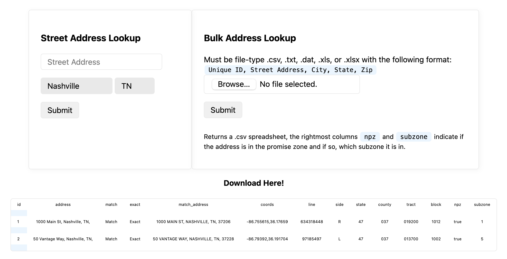

# Nashville Promise Zone Locator

## Description
This web app reports whether or not addresses are in the Nashville Promise Zone. It uses the [US Census Geocoder](https://geocoding.geo.census.gov/geocoder) to find the census tract of an address and compares the result with a list of subzones in the Nashville Promise Zone.

It is written in PHP and, aside from the census tract image files, exists wholly within the index.php file.

The app can take either a single address or a bulk upload.
## Examples
### Single Address

### Bulk Upload

